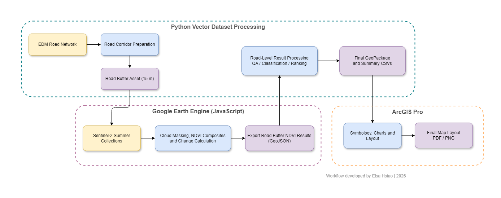
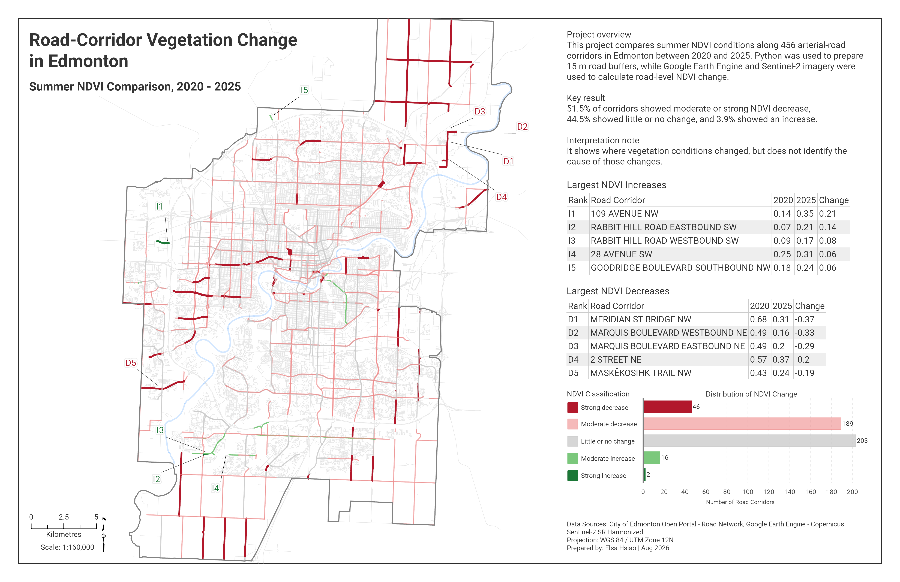

# Edmonton Road-Corridor Vegetation Change

This project analyzes vegetation change along Edmonton's major road corridors between 2020 and 2025 using Sentinel-2 NDVI.

The workflow combines Python for road-data preparation, Google Earth Engine for satellite-image processing, Python for result classification and ranking, and ArcGIS Pro for the final map and charts.

## Workflow

1. Download and clean the Edmonton road network.
2. Select eligible arterial roads and dissolve segments by street name.
3. Create 15 m road buffers and prepare the input for Google Earth Engine.
4. Build summer Sentinel-2 NDVI composites for 2020 and 2025.
5. Calculate NDVI change and mean road-buffer statistics in Google Earth Engine.
6. Process, classify, and rank the exported road-level results in Python.
7. Prepare the final map, charts, and layout in ArcGIS Pro.

## Tools

- Python
- GeoPandas
- Pandas
- NumPy
- Google Earth Engine JavaScript API
- Sentinel-2 Surface Reflectance Harmonized
- Sentinel-2 Cloud Probability
- ArcGIS Pro

## Key Results

The analysis includes 456 named road corridors.

- Strong decrease: 46 corridors
- Moderate decrease: 189 corridors
- Little or no change: 203 corridors
- Moderate increase: 16 corridors
- Strong increase: 2 corridors

Overall, 51.5% of corridors showed moderate or strong decreases, 44.5% showed little or no change, and 3.9% showed moderate or strong increases.

## Notes

The results represent estimated vegetation change from summer Sentinel-2 imagery and should not be treated as exact ground conditions.

Each corridor value is an average within a 15 m road buffer. Road sections with the same street name were grouped into one corridor, including sections that are not directly connected, so smaller local changes may be reduced or hidden in the corridor-level result.

The Google Earth Engine script uses a placeholder road-buffer asset path. To run the script, replace it with an asset available in your own Earth Engine project.

Large source datasets, generated GeoPackages, and Earth Engine assets are not included in this repository.

## Author

Elsa Hsiao | 2026

This repository is shared as a portfolio project. Please do not reproduce or present the maps, workflow diagrams, written content, or project results as your own.

